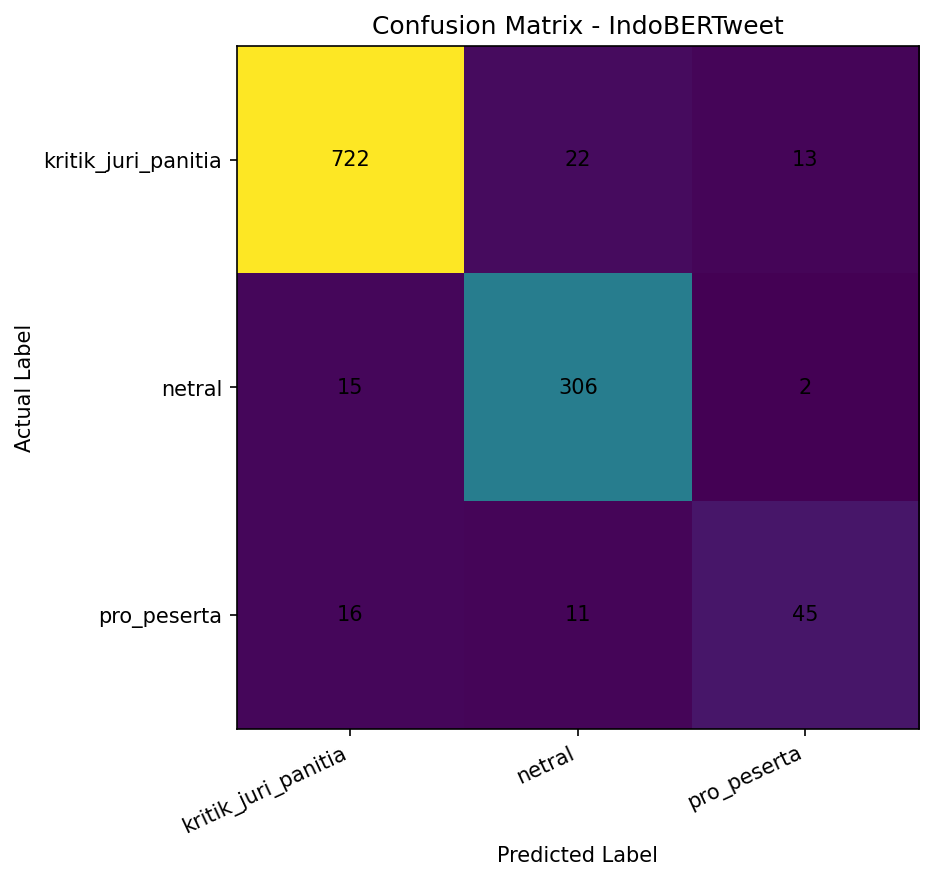
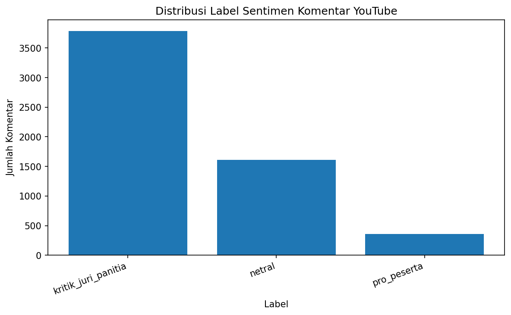
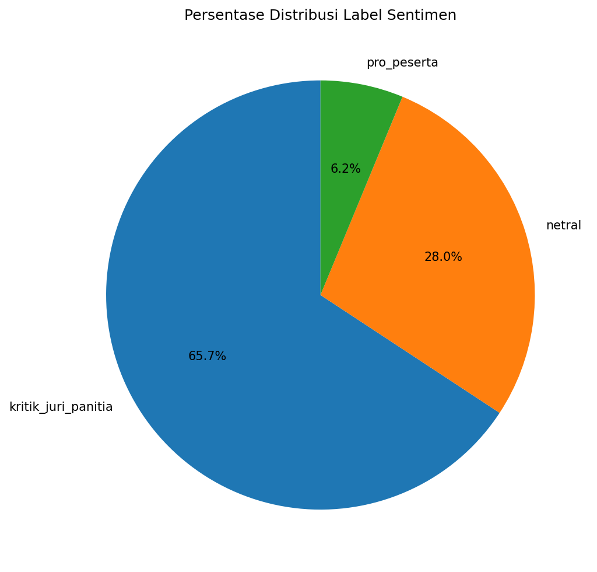
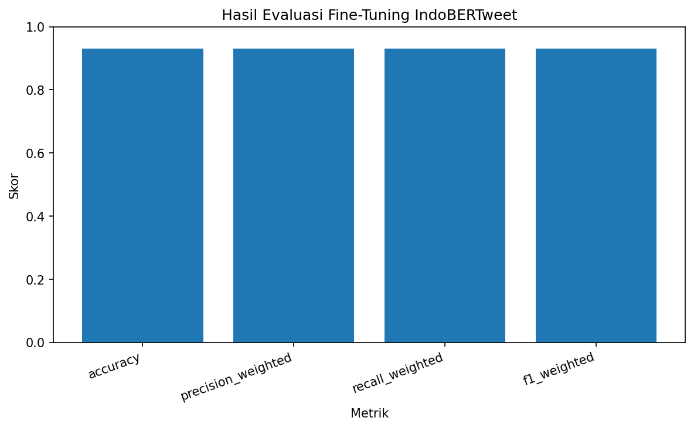
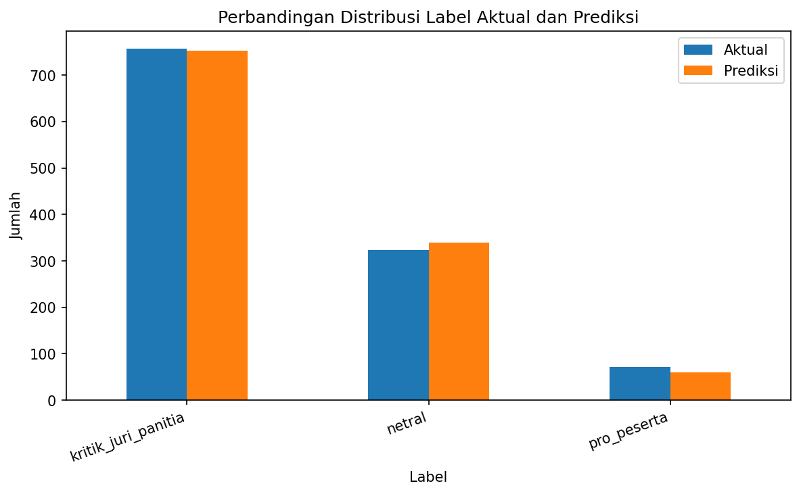

<p align="center">
  
</p>

<p align="center">
  <a href="https://www.python.org/"></a>
  <a href="https://pytorch.org/"></a>
  <a href="https://huggingface.co/"></a>
  <a href="https://flask.palletsprojects.com/"></a>
  
</p>

<p align="center">
  
</p>


## 📌 Deskripsi Proyek

Lomba Cerdas Cermat (LCC) 4 Pilar tingkat Provinsi di Kalimantan Barat menimbulkan kontroversi yang memicu perdebatan hangat di kolom komentar YouTube. Proyek ini melakukan analisis sentimen terhadap **6.000 komentar** untuk mengekstrak opini publik dan mengklasifikasikannya ke dalam **3 kelas sentimen** utama:

<table>
<tr>
<td align="center">🔴</td>
<td><b><code>kritik_juri_panitia</code></b></td>
<td>Komentar berisi keluhan, kritik, atau tuduhan ketidakadilan terhadap juri dan panitia</td>
</tr>
<tr>
<td align="center">🔵</td>
<td><b><code>netral</code></b></td>
<td>Komentar objektif, netral, saran damai, atau tidak memihak pihak tertentu</td>
</tr>
<tr>
<td align="center">🟢</td>
<td><b><code>pro_peserta</code></b></td>
<td>Komentar berisi dukungan moral dan pembelaan kepada para peserta/siswa yang berlomba</td>
</tr>
</table>

> Menggunakan arsitektur model **IndoBERTweet** — model bahasa BERT yang di-pretrain khusus pada media sosial berbahasa Indonesia — sistem ini mampu memahami slang, singkatan, serta gaya bahasa informal khas warganet Indonesia dengan sangat baik.


## 📊 Hasil Evaluasi Model

Model IndoBERTweet berhasil dievaluasi menggunakan *split* data uji independen dan memperoleh metrik performa tinggi:

<div align="center">

| Metrik | Nilai |
| :--- | :---: |
| ⚡ **Akurasi Keseluruhan** | **93.28%** |
| 📈 **Macro F1-Score** | **90.31%** |
| 📊 **Weighted F1-Score** | **92.41%** |

</div>

### 🏆 Per-Class Performance

<div align="center">

| Kelas Sentimen | Precision | Recall | F1-Score | Support |
| :--- | :---: | :---: | :---: | :---: |
| 🔴 **Kritik Juri / Panitia** | 0.94 | 0.96 | 0.95 | 330 |
| 🔵 **Netral** | 0.91 | 0.91 | 0.91 | 180 |
| 🟢 **Pro Peserta** | 0.92 | 0.79 | 0.85 | 90 |

</div>

### 🔬 Visualisasi Evaluasi

<p align="center">
  
</p>
<p align="center"><i>Confusion Matrix — Hasil pengujian model pada data uji (test set)</i></p>

<details>
<summary>📈 <b>Klik untuk melihat visualisasi tambahan</b></summary>
<br>

<p align="center">
  
  
</p>

<p align="center">
  
  
</p>

</details>


## 📁 Struktur Direktori

```
Proyek_IndoBERTweet_LCC_Kalbar_6000/
│
├── 📂 dataset/                   # Dataset CSV & Excel (Raw → Preprocessed → Labeled)
│   ├── komentar_raw_6000.csv
│   ├── komentar_preprocessed_6000.csv
│   └── komentar_labeled_6000.csv
│
├── 📂 hasil/                     # Visualisasi chart, evaluasi, & aset grafis
│   ├── confusion_matrix_indobertweet.png
│   ├── banner_hero.svg
│   ├── classification_report_indobertweet.txt
│   └── ringkasan_eda_lengkap.xlsx
│
├── 📂 laporan/                   # Laporan PDF/Word & PowerPoint Presentasi
│   ├── Laporan Klasifikasi Sentimen (...).pdf
│   └── PPT_Klasifikasi_Sentimen (...).pptx
│
├── 📂 model/                     # Konfigurasi & bobot model IndoBERTweet
│   └── indobertweet_finetuned/
│       ├── config.json
│       ├── label_mapping.json
│       ├── tokenizer.json
│       └── model.safetensors     # ⚠️ ~442MB (gitignored)
│
├── 📂 source_code/               # Jupyter Notebook (EDA → Fine-Tuning)
│   └── IndoBERTweet_6000_YouTube_LCC_Kalbar_TERBARU_AMAN.ipynb
│
└── 📂 webapp/                    # Flask Web App Demo Interaktif
    ├── app.py                    # Server backend Flask
    ├── requirements.txt
    ├── static/css/style.css      # Dark mode glassmorphism UI
    ├── static/js/main.js         # Prediction logic & animations
    └── templates/index.html      # Halaman utama webapp
```


## ⚡ Panduan Instalasi & Menjalankan Web App

### 1️⃣ Prasyarat
Pastikan komputer Anda sudah terinstal **Python 3.8+** dan `pip`.

### 2️⃣ Kloning Repositori
```bash
git clone https://github.com/Renoslendra/IndoBERTweet-LCC-Kalbar-2026.git
cd IndoBERTweet-LCC-Kalbar-2026
```

### 3️⃣ Instal Dependensi
```bash
pip install -r webapp/requirements.txt
```

### 4️⃣ Letakkan File Bobot Model
> ⚠️ File `model.safetensors` (~442 MB) dikecualikan dari Git. Pastikan file tersebut berada di:
> `model/indobertweet_finetuned/model.safetensors`

### 5️⃣ Jalankan Aplikasi Web
```bash
cd webapp
python app.py
```

Buka browser dan akses: **[http://127.0.0.1:5000](http://127.0.0.1:5000)** 🚀


## 🎨 Fitur Web App

<table>
<tr>
<td width="50" align="center">💬</td>
<td><b>Interactive Single Input</b><br>Ketik komentar dan lihat hasil prediksi sentimen secara real-time</td>
</tr>
<tr>
<td align="center">📊</td>
<td><b>Confidence Level Chart</b><br>Distribusi probabilitas per kelas dalam grafik persentase interaktif</td>
</tr>
<tr>
<td align="center">🏆</td>
<td><b>Visual Performance Metrics</b><br>Classification report & akurasi model ditampilkan langsung di antarmuka</td>
</tr>
<tr>
<td align="center">📜</td>
<td><b>Prediction History</b><br>Riwayat prediksi selama sesi aktif untuk perbandingan cepat</td>
</tr>
<tr>
<td align="center">🌙</td>
<td><b>Dark Mode Glassmorphism</b><br>Tampilan premium dengan animasi scroll-reveal, particles, dan gradient effects</td>
</tr>
</table>


## 🛠️ Tech Stack

<div align="center">

| Komponen | Teknologi |
| :--- | :--- |
| 🧠 **Language Model** | [IndoBERTweet Base Uncased](https://huggingface.co/indobenchmark/indobertweet-base-uncased) |
| ⚙️ **Deep Learning** | PyTorch + Hugging Face Transformers |
| 🌐 **Web Backend** | Flask (Python) |
| 🎨 **Frontend** | HTML5 + CSS3 (Glassmorphism) + Vanilla JS |
| 📐 **Data Processing** | Pandas, NumPy, Scikit-learn |
| 🔤 **Typography** | Outfit · Inter · JetBrains Mono (Google Fonts) |

</div>


## 👨‍🎓 Informasi Akademik

<div align="center">

| Info | Detail |
| :--- | :--- |
| 🎓 **Mata Kuliah** | Penambangan Data (Data Mining) |
| 📅 **Semester** | 4 (Empat) |
| 📝 **Topik** | Klasifikasi Sentimen Multi-Kelas dengan Fine-tuning BERT |
| 📊 **Dataset** | 6.000 komentar asli YouTube |
| 🎯 **Model** | IndoBERTweet (Pretrained Indonesian Social Media BERT) |

</div>


<p align="center">
  
</p>

<p align="center">
  <sub>Mata Kuliah Penambangan Data · Powered by IndoBERTweet · PyTorch · Flask</sub>
</p>
